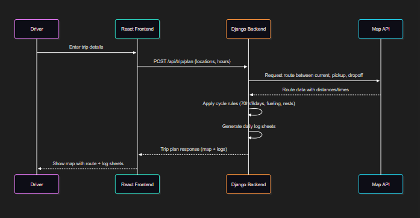

# Driver Trip Logs

A full-stack web application that allows drivers to plan trips, view routes with stops and rests, and generate **Electronic Logging Device (ELD) daily log sheets**.  

Built with **Django (backend)** and **React + TypeScript (frontend)**.  

---

## Features
- Input trip details:
  - Current location
  - Pickup location
  - Dropoff location
  - Current cycle hours used
- Outputs:
  - Map showing route, stops, and rests (via OpenStreetMap APIs)
  - Daily log sheets auto-filled with trip activities
- RESTful API backend with Django REST Framework
- Modern frontend interface with React + TypeScript

---

## Technologies Used
### Backend
- Python 3.11+
- Django 5.x
- Django REST Framework
- SQLite (development DB)

### Frontend
- React 18 + TypeScript
- Vite (build tool)
- Axios (API calls)
- TailwindCSS (styling)
- React Query (optional for API state)

### APIs
- OpenStreetMap / OpenRouteService (routing, geocoding)

### Dev Tools
- Docker (optional, for containerized setup)
- Git

### Diagrams & Architechure Tools
- Draw IO

### Diagrams

- Sequence Diagram

- [C4 model](https://drive.google.com/file/d/1Gx2yQOs2p38K3KiSkKqVjWQYcE-b-Jcf/view)
